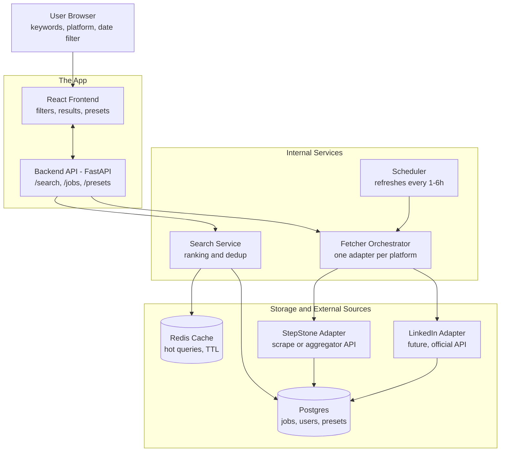

# Find Your Best — Project Plan

A web application that helps users discover the most relevant jobs based on their chosen keywords, job type, and preferred job platforms.

---

## 1. What is this project, in plain English?

Imagine you're job hunting. You probably:

1. Open StepStone, type "React developer", scroll through pages.
2. Open LinkedIn, do the same thing again.
3. Try to remember which jobs you already saw.
4. Lose track of which ones were posted today vs. last month.

**Find Your Best** does all of that for you in one place. You type your keywords once, pick which job sites to search, and it shows you a single, clean list of matching jobs — newest first, duplicates removed.

Think of it like a **smart shopping assistant**, but for jobs:
- You tell it what you want ("frontend developer, Berlin, full-time").
- It checks every store (StepStone today; LinkedIn and others later).
- It hands you back the best matches, freshest first.

---

## 2. Who uses it and what do they do?

| User goal | What they do in the app |
|---|---|
| Find a job fast | Type keywords, pick "last 24 hours", get a list |
| Save effort on repeated searches | Use a preset like "Backend Python" instead of typing everything again |
| Personalize the search | Add their own keywords on top of presets |
| Choose where to look | Toggle which platforms to include (StepStone on, LinkedIn off, etc.) |

---

## 3. How it works — the flow diagram

This diagram shows the journey of one search, from the moment the user clicks "Search" until results appear on screen.



### What each box means (in plain words)

| Box | What it does (plain English) |
|---|---|
| **User Browser** | The window you actually see and click — Chrome, Safari, Firefox. |
| **React Frontend** | The visible part of the app: input boxes, buttons, the job list. |
| **Backend API** | The "brain" of the app. The frontend asks it questions; it answers. |
| **Search Service** | Decides which jobs are most relevant and removes duplicates. |
| **Fetcher Orchestrator** | The traffic cop — decides which job platforms to ask, in parallel. |
| **Scheduler** | A robot that wakes up every few hours to refresh job data so you don't have to wait. |
| **Postgres** | A filing cabinet — stores every job we've ever fetched, plus your saved keywords. |
| **Redis Cache** | A sticky-note pad — remembers very recent searches so we don't redo work. |
| **StepStone / LinkedIn Adapter** | A translator that knows how to talk to each job platform. |

### What happens when you click "Search"

1. You type "React developer", pick StepStone, choose "last 24 hours", and click Search.
2. The frontend sends your request to the backend.
3. The backend first checks Redis (the sticky-note pad) — did someone search this 10 minutes ago? If yes, instant answer.
4. If not, it asks the Fetcher Orchestrator to go get fresh data from StepStone.
5. The StepStone adapter does its thing, returns a clean list of jobs.
6. The Search Service scores each job (better keyword match = higher score), removes duplicates, sorts by freshness.
7. Results are saved in Postgres and Redis (so the next person searching the same thing gets an instant answer).
8. The frontend shows you the final list.

---

## 4. The technology choices (and why)

For a non-technical reader: these are like choosing which power tools to use to build a house. Each tool has a job.

| Part of the app | Tool | Why we chose it (plain words) |
|---|---|---|
| The visible part you click | **React + Vite** | The standard modern way to build fast, interactive web pages. |
| The brain (server) | **Python + FastAPI** | Python is the easiest language for handling job-site data; FastAPI makes building the brain quick and reliable. |
| Storage (filing cabinet) | **PostgreSQL** | A rock-solid database that's been used for decades by big companies. |
| Fast memory (sticky notes) | **Redis** | Super fast for "remember this for 15 minutes" type tasks. |
| Auto-refresh robot | **APScheduler** | A small tool that runs jobs on a schedule, like a cron alarm clock. |
| Reading stubborn websites | **Playwright** (only if needed) | Pretends to be a real browser so it can read sites that block normal robots. |

---

## 5. Step-by-step build plan

Each step builds on the last. A non-technical reader can think of these as **chapters in building the house**.

### Step 1 — Decide what a "Job" looks like

Before anything else, agree on the shape of a single job record. No matter where it came from (StepStone, LinkedIn, anywhere), it must be stored the same way:

```
id, source, source_job_id, title, company, location,
posted_at, fetched_at, url, description, keywords[]
```

**Why this matters:** if every platform stored data differently, the rest of the app would be a tangled mess. One shape = one clean codebase.

### Step 2 — Build the "Adapter" pattern

An **adapter** is a small program that knows how to talk to one specific job site. We build one rule (interface) that every adapter must follow:

> "Given keywords, a job type, and a date range — give me back a list of jobs in the agreed shape."

**Analogy:** think of plugs and sockets. Every country has different sockets (UK, EU, US). An adapter lets your phone charger work everywhere. Same idea — StepStone speaks one "language", LinkedIn speaks another, but our adapters translate both to the same internal language.

### Step 3 — Build the StepStone adapter

The first real adapter. See **Section 6** below for the honest story of how this actually works (it's not as simple as "call their API").

### Step 4 — Build the backend endpoints

These are the "questions" the frontend can ask the brain:

| Endpoint | What it does |
|---|---|
| `POST /search` | "Find me jobs matching these keywords on these platforms" |
| `GET /presets` | "What ready-made keyword bundles are available?" (e.g. "Frontend React", "Data Engineer") |
| `POST /presets` | "Save my custom keyword set" |

### Step 5 — Build the search / ranking logic

Not every match is equal. We score jobs:
- Keyword found in **title** = 3 points
- Keyword found in **description** = 1 point
- Posted in the **last 24 hours** = bonus boost
- Show highest score first

### Step 6 — Build the scheduler

A small background robot that wakes up every few hours and pre-fetches results for popular keyword sets. **Why?** So when a user searches "React developer Berlin", the answer is already waiting in Postgres — they don't have to wait for live scraping.

### Step 7 — Build the frontend

The visible app. Key UI pieces:
- A **chip-style input** for keywords (each keyword becomes a removable tag).
- A **multi-select** for platforms (StepStone, future LinkedIn).
- A **dropdown** for "Posted within" (1h / 24h / 7d / 30d).
- **Result cards** showing title, company, location, "posted 3 hours ago", a platform badge, and an "Open on StepStone" button.

### Step 8 — Test and ship

Try real searches, fix what breaks, deploy.

---

## 6. The honest truth about getting data from StepStone

**Short answer: StepStone does NOT have a public API for job searching.** Their official API is reserved for partners (recruiters, ATS integrations). So we have three realistic options, each with trade-offs:

| Option | How it works | Pros | Cons |
|---|---|---|---|
| **A. Use an aggregator API** *(recommended start)* | Services like [Adzuna](https://developer.adzuna.com/), [JSearch on RapidAPI](https://rapidapi.com/letscrape-6bRBa3QguO5/api/jsearch), or TheirStack already collect StepStone (and many others) and offer a clean API | Legal, clean JSON, free tiers, easy to start | Data may be a few hours behind StepStone's own site |
| **B. Scrape StepStone directly** | A robot browser opens StepStone search pages and reads them like a human would | Always freshest data | Against their terms of service, breaks when they change their website, needs proxies and anti-bot handling — risky for a public product |
| **C. RSS feed** | StepStone used to expose RSS feeds for search URLs | Dead simple if it works | Largely deprecated; coverage is poor and dates imprecise |

### My strong recommendation

**Start with Option A (aggregator API).** You can have a working app in days, you stay on the right side of the law, and the adapter pattern means you can swap to a direct scraper later without touching the rest of the app.

For **LinkedIn (future):** the same reality. No open public API. Either use an aggregator that covers LinkedIn or apply for their official Talent Solutions API (partnership required). **Don't scrape LinkedIn directly** — they're aggressive about blocking and it's a legal minefield.

---

## 7. Important things to validate and watch out for

These are the "gotchas" — things that look easy but bite you later.

### "Posted in the last 24 hours" is harder than it looks

Most job sites show fuzzy times like "2 days ago", not exact timestamps. So:
- Store the **date** as best you know it.
- Treat the "last 24h" filter as **best-effort**, not perfectly precise.
- In the UI, say "posted today" or "posted yesterday" rather than fake-precise "3 hours ago" if we don't actually know.

### Duplicate jobs

The same job often appears on 3 sites at once. We need to:
- Detect duplicates by matching on `(company + title + location)`.
- Show one card with a small note: *"Also listed on: LinkedIn, Indeed"*.

### Cache aggressively

Same user runs the same search 5 times in one session. Don't re-fetch every time — keep results in Redis for 15-30 minutes.

### Keep API keys secret

Aggregator API keys must live on the **backend only**, never in the frontend code. If a key reaches the user's browser, anyone can steal it and run up your bill.

### The law matters

If we go the scraping route, we must respect `robots.txt` and the platform's terms of service. For a product we plan to put online publicly, **aggregator APIs are the safer choice**.

### Skip user accounts in v1

Don't build a login system yet. Save user keywords in their browser (`localStorage`). Add accounts only when there's a real reason — saved searches, email alerts, syncing across devices.

### A feature worth designing for, even if not building yet

**Email or Slack alerts when a new matching job appears.** Since we already have the scheduler refreshing data in the background, this becomes almost free to add later. Plan the data model with this in mind (store user → preset → notification preferences).

---

## 8. Suggested roadmap

| Phase | Goal | What's done |
|---|---|---|
| **MVP (2-3 weeks)** | Single-platform search that works | StepStone via aggregator, keyword + 24h filter, basic UI |
| **v1.1** | Quality of life | Presets, custom keywords (localStorage), duplicate detection |
| **v1.2** | Multi-platform | Add LinkedIn adapter (via aggregator), platform toggles |
| **v2** | Power features | User accounts, saved searches, email alerts |
| **v3** | Polish | Better ranking, salary filters, mobile-friendly UI |

---

## 9. Open questions to decide before building

These are decisions you should make explicitly — they affect the architecture.

1. **Aggregator choice:** Adzuna (free tier, clear pricing) vs. JSearch on RapidAPI (broader coverage, paid tiers). Try both free tiers and compare StepStone coverage for your target region.
2. **Region:** German market (StepStone is primarily DE), or broader? Affects which aggregators to pick.
3. **Hosting:** local-only for now, or deploy to a cloud (Render, Railway, Fly.io are cheap starts)?
4. **Login or no login in v1?** Strong recommendation: no login until v2.
5. **Mobile:** is mobile-first important? If yes, design the UI accordingly from day 1.

---

*Document version: v1 — initial project plan.*
